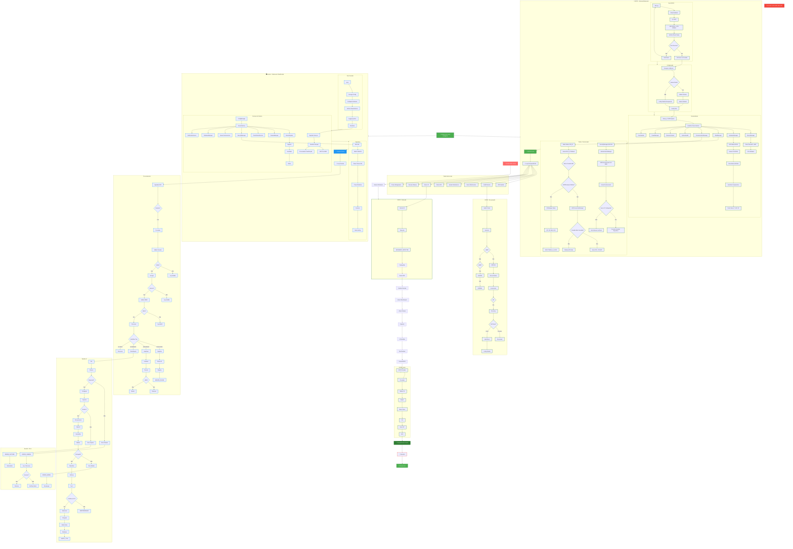

```mermaid
graph TB
    %% =============================================
    %% SISTEMA PRINCIPAL
    %% =============================================
    START[🏢 Sistema de Lixeira Inteligente]
    
    subgraph ESP32_SYSTEM ["🧩 ESP32 - Sistema Embarcado"]
        ESP32_BOOT --> ESP32_CONFIG
        ESP32_CONFIG --> ESP32_MANAGERS
        ESP32_MANAGERS --> ESP32_NETWORK
        ESP32_NETWORK --> ESP32_READY[✅ ESP32 Pronto]
        ESP32_READY --> ESP32_MAIN_LOOP
    end

    subgraph SERVER_SYSTEM ["🖥️ Servidor - Sistema de Classificação"]
        SERVER_BOOT --> SERVER_SERVICES
        SERVER_SERVICES --> SERVER_SECURITY
        SERVER_SECURITY --> SERVER_READY[✅ Servidor Pronto]
        SERVER_READY --> SERVER_MAIN_LOOP
    end

    START --> ESP32_SYSTEM
    START --> SERVER_SYSTEM

    %% =============================================
    %% ESP32 - COMPONENTES COMPACTOS
    %% =============================================
    subgraph ESP32_BOOT ["Boot ESP32"]
        A[Boot.py] --> B[Setup Hardware] --> C[gc.collect] --> D[LED GPIO2 + CPU 240MHz] --> F[Verificar Reset Cause] --> G{Boot Sucesso?}
        G -->|Sim| H[LED Boot: 3x Piscadas]
        G -->|Não| I[Hard Reset] --> A
    end

    subgraph ESP32_CONFIG ["Configuração"]
        H --> J[Carregar config.json] --> K{Arquivo Existe?}
        K -->|Sim| L[Validar Schema] --> N[Aplicar Defaults] --> P[Config Final]
        K -->|Não| M[Config Padrão Emergencial] --> P
    end

    subgraph ESP32_MANAGERS ["Gerenciadores"]
        P --> Q[Main.py - ESP32System] --> R[Inicializar Gerenciadores]
        R --> S[DeviceManager] & T[HardwareManager] & U[WlanManager] & V[CommunicationManager] & W[SystemHealth] & X[RecoverySystem] & Y[PowerManager] & Z[ErrorHandler]
        S --> S1[Gerar DeviceID + MAC] --> S2[Info Hardware]
        T --> T1[LED Status GPIO2] --> T2[Sensor IR GPIO34] --> T3[Servo Motor GPIO18] --> T4[Inicializar Componentes] --> T5[Testar Servo 0°-180°-90°]
    end

    subgraph ESP32_NETWORK ["Rede e Comunicação"]
        U --> U1[Modo Station STA_IF] --> U2[Modo AP AP_IF Fallback] --> U3{Tentar Conexão WiFi} --> U4{SSID/Password Válidos?}
        U4 -->|Sim| U5[WiFiConnectionManager] --> U7{Conexão Bem Sucedida?}
        U7 -->|Sim| U8[Modo STA - IP DHCP]
        U7 -->|Não| U9[Fallback AP Mode]
        U4 -->|Não| U6[APManager Setup] --> U10[AP: 192.168.4.1/24] --> U11[SSID: TRASH_AI_XXXX]
        
        V --> V1[SecurityManager AES-256] --> V2[AuthenticationManager] --> V3[UDPCommunicator Port 8889] --> V4[ServerCommunicator] --> V5{Server IP Configurado?}
        V5 -->|Sim| V6[Conectar Servidor Específico]
        V5 -->|Não| V7[Auto-discover na Rede]
    end

    subgraph ESP32_TASKS ["Tasks Assíncronas"]
        ESP32_MAIN_LOOP["🔄 Loop Principal ESP32"] --> AB[UDP Handler] & AC[Health Monitor] & AD[Server Maintenance] & AE[System Maintenance] & AF[Status LED] & AG[Sensor IR] & AH[Security Cleanup] & AI[Power Management]
    end

    %% =============================================
    %% SERVIDOR - COMPONENTES COMPACTOS
    %% =============================================
    subgraph SERVER_BOOT ["Boot Servidor"]
        SA[Início] --> SB[Carregar Config] --> SC[Configurar Ambiente] --> SD[Verificar Dependências] --> SE[Logging System] --> SF[Diretórios]
    end

    subgraph SERVER_SERVICES ["Serviços do Sistema"]
        SF --> SG[Registrar Serviços] --> SH[Servidor Principal] --> SI[UDP Port 8889] & SJ[Processador Classificação]
        SK[ConfigManager] --> SL[ServiceFactory] --> SM[DeviceRegistry] & SN[CameraManager] & SO[ClassificationService] & SP[SecurityManager] & SQ[ServerCommunicator] & SR[DatabaseManager] & SS[NotificationService]
        SM --> SM1[Registro] --> SM2[Heartbeat] --> SM3[Status]
    end

    subgraph SERVER_SECURITY ["Segurança"]
        SP --> SP1[AES-256] --> SP2[HMAC-SHA256] --> SP3[Token Timeout 30s] --> SP4[Chave Dinâmica] --> SP5[Sessions] --> SP6[Rate Limiting]
    end

    subgraph SERVER_PROCESSING ["Processamento"]
        SERVER_MAIN_LOOP["🔄 Loop Servidor"] --> SAB[Aguardar UDP] --> SAC{Recebeu?}
        SAC -->|Sim| SAD[Processar] --> SAE[Validar Formato] --> SAF{Válido?}
        SAF -->|Não| SAG[Log Inválido]
        SAF -->|Sim| SAH[Decrypt] --> SAI{Sucesso?}
        SAI -->|Não| SAJ[Log Inválida]
        SAI -->|Sim| SAK[Validar HMAC] --> SAL{Válido?}
        SAL -->|Não| SAM[Log HMAC]
        SAL -->|Sim| SAN[Processar] --> SAO{Identificar Tipo}
        SAO -->|DISCOVERY| SAP[Registrar] --> SAP1[Device ID] --> SAP2[Registry] --> SAP3[SERVER_ONLINE]
        SAO -->|HEARTBEAT| SAR[Heartbeat] --> SAR1[LastSeen] --> SAR2[Timeout] --> SAR3{>300s?}
        SAR3 -->|Sim| SAR4[Remover]
        SAR3 -->|Não| SAR5[Manter]
        SAO -->|MOVEMENT| SAS[Classificação]
        SAO -->|OUTROS| SAT[Processar]
    end

    %% =============================================
    %% FLUXO DO USUÁRIO
    %% =============================================
    USER_ACTION[👤 Usuário Abre Lixeira] --> IR_TRIGGER[Sensor IR Detecta] --> ESP32_DETECTION
    
    subgraph ESP32_DETECTION ["ESP32 - Detecção"]
        AG --> AG1[Monitor IR] --> AG2[Detecção] --> AG3[MOVEMENT_DETECTED] --> ENCRYPT_MSG[Criptografar] --> SEND_UDP[Enviar UDP]
    end

    SEND_UDP --> SERVER_RECEIVE[Servidor Recebe] --> CLASSIFICATION_START[Iniciar Classificação] --> CAMERA_ACTIVATE[Ativar Câmera] --> CAPTURE_IMAGE[Capturar] --> AI_PROCESS[IA TrashNet] --> GET_RESULT[Tipo Resíduo] --> SEND_RESULT[Enviar ESP32]
    
    SEND_RESULT --> ESP32_RECEIVE[ESP32 Recebe] --> ESP32_ACTION
    
    subgraph ESP32_ACTION ["ESP32 - Ação"]
        ESP32_RECEIVE --> PROCESS_WASTE[Processar] --> VALIDATE_INDEX[Validar 0-4] --> CALC_ANGLE[Ângulo] --> MOVE_SERVO[Mover Servo] --> WAIT_DELAY[1.5s] --> RESET_SERVO[Reset 90°] --> SEND_ACK[ACK]
    end

    SEND_ACK --> USER_FEEDBACK[✅ Compartimento Correto] --> USER_DISPOSE[👤 Descarta] --> SYSTEM_READY[🔄 Próximo Uso]

    %% =============================================
    %% CLASSIFICAÇÃO IA
    %% =============================================
    subgraph CLASSIFICATION ["Pipeline IA"]
        SAS --> SBA[Fila] --> SBB[Câmera] --> SBC{Disponível?}
        SBC -->|Não| SBD[Error Câmera]
        SBC -->|Sim| SBE[Configurar] --> SBF[Capturar] --> SBG{Sucesso?}
        SBG -->|Não| SBH[Error Captura]
        SBG -->|Sim| SBI[Pré-processar] --> SBJ[224x224] --> SBK[Normalizar] --> SBL[Modelo] --> SBM{Carregado?}
        SBM -->|Não| SBN[Error Modelo]
        SBM -->|Sim| SBO[Classificar] --> SBP[Softmax] --> SBQ[Top 3] --> SBR{Confiança ≥0.6?}
        SBR -->|Não| SBS[INDETERMINADO]
        SBR -->|Sim| SBT[Selecionar] --> SBU[Categoria] --> SBV[Waste Index] --> SBW[Database] --> SBX[WASTE_TYPE]
    end

    %% =============================================
    %% TRATAMENTO DE ERROS
    %% =============================================
    subgraph ERROR_RECOVERY_ESP32 ["ESP32 - Recuperação"]
        AC --> AC1[Health Check] --> AC2[Memória] --> AC3{<4KB?}
        AC3 -->|Sim| AC4[CRÍTICO] --> AC8[Record Failure] --> AC8A[Incrementar] --> AC8B{≥5?}
        AC8B -->|Sim| AC8C[Recovery] --> AC8E{Soft Reset?}
        AC8E -->|Sucesso| AC8F[Recovered]
        AC8E -->|Falha| AC8G[Hard Reset] --> AC8H[Config Padrão]
        AC3 -->|Não| AC5{<8KB?} -->|Sim| AC6[ALERTA] -->|Não| AC7[NORMAL]
    end

    subgraph ERROR_HANDLING_SERVER ["Servidor - Erros"]
        SBD --> SCA[ERROR_CAMERA] --> SCA1[Log + Recovery] --> SCA2{Sucesso?}
        SCA2 -->|Não| SCA3[Notificar Admin]
        SCA2 -->|Sim| SCA4[Retomar]
        SBH --> SCB[ERROR_CAPTURE] --> SCB1[Reinicializar]
        SBN --> SCC[ERROR_MODEL] --> SCC1[Recarregar]
    end

    %% =============================================
    %% ESTILOS
    %% =============================================
    style START fill:#4CAF50,color:white
    style USER_ACTION fill:#FF6B6B,color:white
    style USER_FEEDBACK fill:#2E7D32,color:white
    style SYSTEM_READY fill:#4CAF50,color:white
    style ESP32_READY fill:#4CAF50,color:white
    style SERVER_READY fill:#2196F3,color:white
    style AC4,AC8C,AC8G,SBD,SBH,SBN fill:#f44336,color:white

    classDef esp32 stroke:#2E7D32,stroke-width:2px
    classDef server stroke:#2196F3,stroke-width:2px
    classDef user stroke:#F44336,stroke-width:2px
    classDef success stroke:#2E7D32,stroke-width:2px

    class A,B,C,D,F,G,H,I,J,K,L,M,N,P,Q,R,S,T,U,V,W,X,Y,Z,S1,S2,T1,T2,T3,T4,T5,U1,U2,U3,U4,U5,U6,U7,U8,U9,U10,U11,V1,V2,V3,V4,V5,V6,V7,ESP32_READY,ESP32_MAIN_LOOP,AB,AC,AD,AE,AF,AG,AH,AI,AG1,AG2,AG3,AC1,AC2,AC3,AC4,AC5,AC6,AC7,AC8,AC8A,AC8B,AC8C,AC8D,AC8E,AC8F,AC8G,AC8H,ESP32_DETECTION,ESP32_RECEIVE,PROCESS_WASTE,VALIDATE_INDEX,CALC_ANGLE,MOVE_SERVO,WAIT_DELAY,RESET_SERVO,SEND_ACK esp32
    class SA,SB,SC,SD,SE,SF,SG,SH,SI,SJ,SK,SL,SM,SN,SO,SP,SQ,SR,SS,SM1,SM2,SM3,SP1,SP2,SP3,SP4,SP5,SP6,SERVER_READY,SERVER_MAIN_LOOP,SAB,SAC,SAD,SAE,SAF,SAG,SAH,SAI,SAJ,SAK,SAL,SAM,SAN,SAO,SAP,SAQ,SAR,SAS,SAT,SAU,SAV,SAP1,SAP2,SAP3,SAR1,SAR2,SAR3,SAR4,SAR5,SBA,SBB,SBC,SBD,SBE,SBF,SBG,SBH,SBI,SBJ,SBK,SBL,SBM,SBN,SBO,SBP,SBQ,SBR,SBS,SBT,SBU,SBV,SBW,SBX,SCA,SCB,SCC,SCA1,SCB1,SCC1,SCA2,SCA3,SCA4 server
    class USER_ACTION,USER_DISPOSE user
    class USER_FEEDBACK,SYSTEM_READY,AC8F success
```